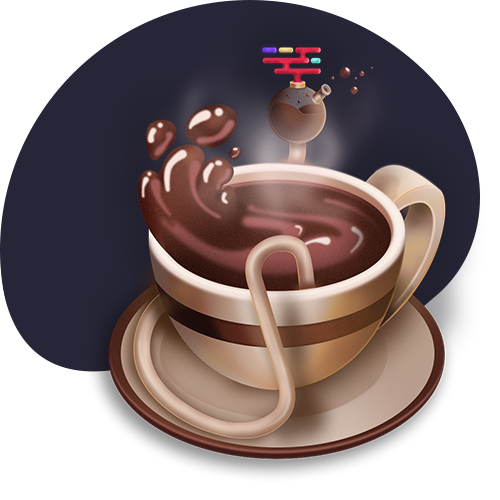
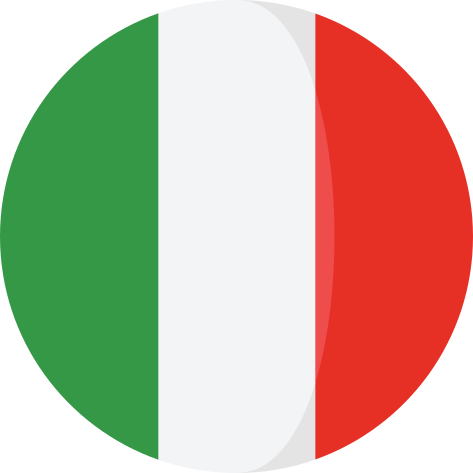
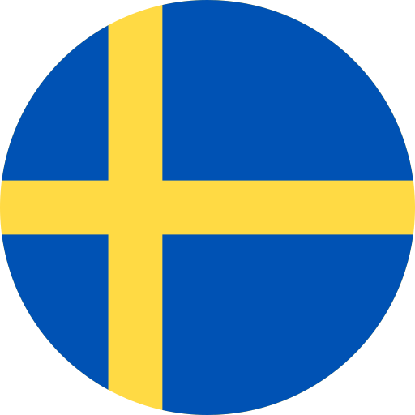
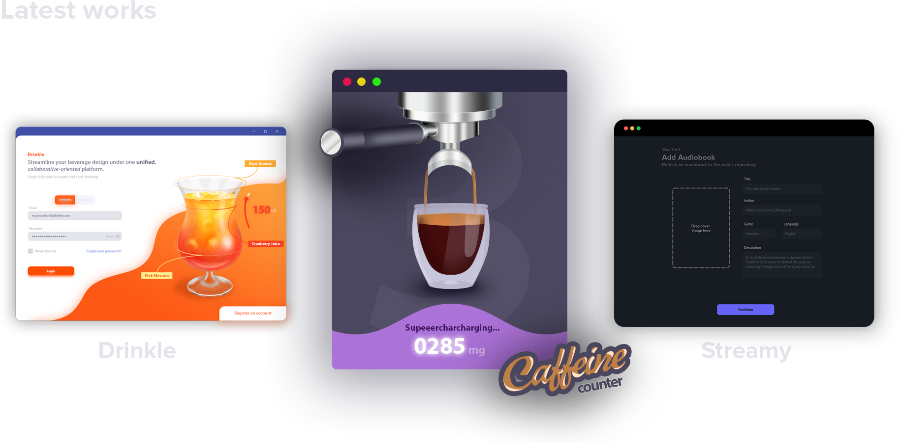
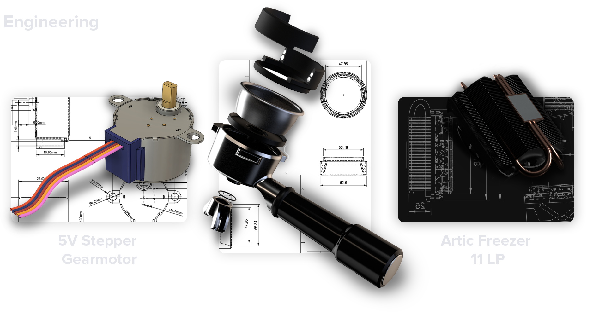

<h2>Vincenzo Buono 

Translating Art into Code
</h2>

### `Dedicated to the exploration of the beauty through an aesthetic of 0s and 1s.`

---
<!-- # Ciao, I'm Vincenzo 👋  -->

### Ciao!👋 _Nice to meet you!_ 
#### I'm Vincenzo, a software engineer from  **Italy**, currently living in  **Sweden**. 

> Below you can find some of my latest works and projects

 
<!-- ## Latest works -->

<!--
**espressoshock/espressoshock** is a ✨ _special_ ✨ repository because its `README.md` (this file) appears on your GitHub profile.

Here are some ideas to get you started:

- 🔭 I’m currently working on ...
- 🌱 I’m currently learning ...
- 👯 I’m looking to collaborate on ...
- 🤔 I’m looking for help with ...
- 💬 Ask me about ...
- 📫 How to reach me: ...
- 😄 Pronouns: ...
- ⚡ Fun fact: ...
-->
